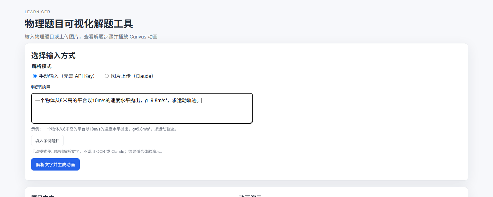
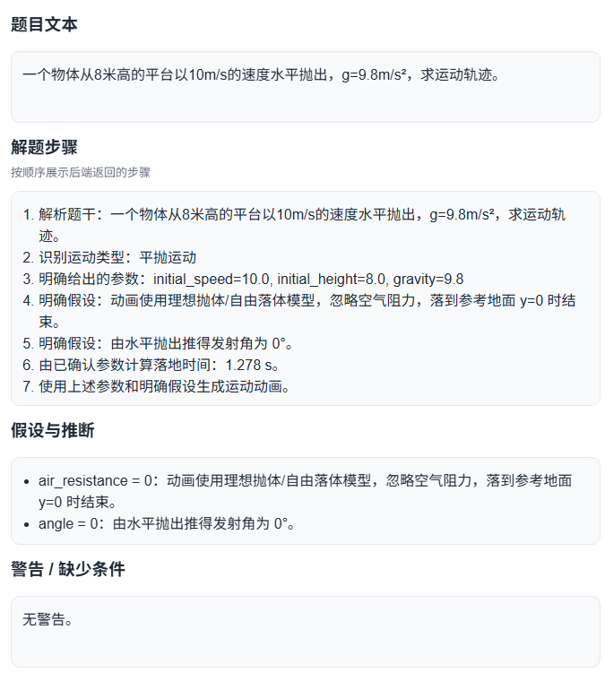
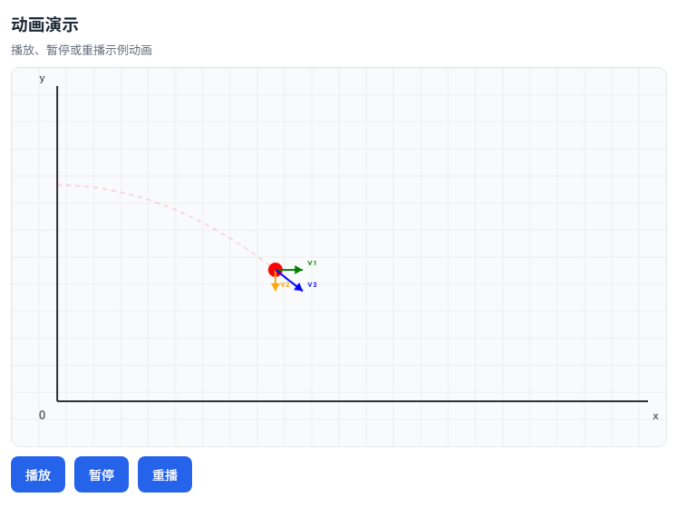
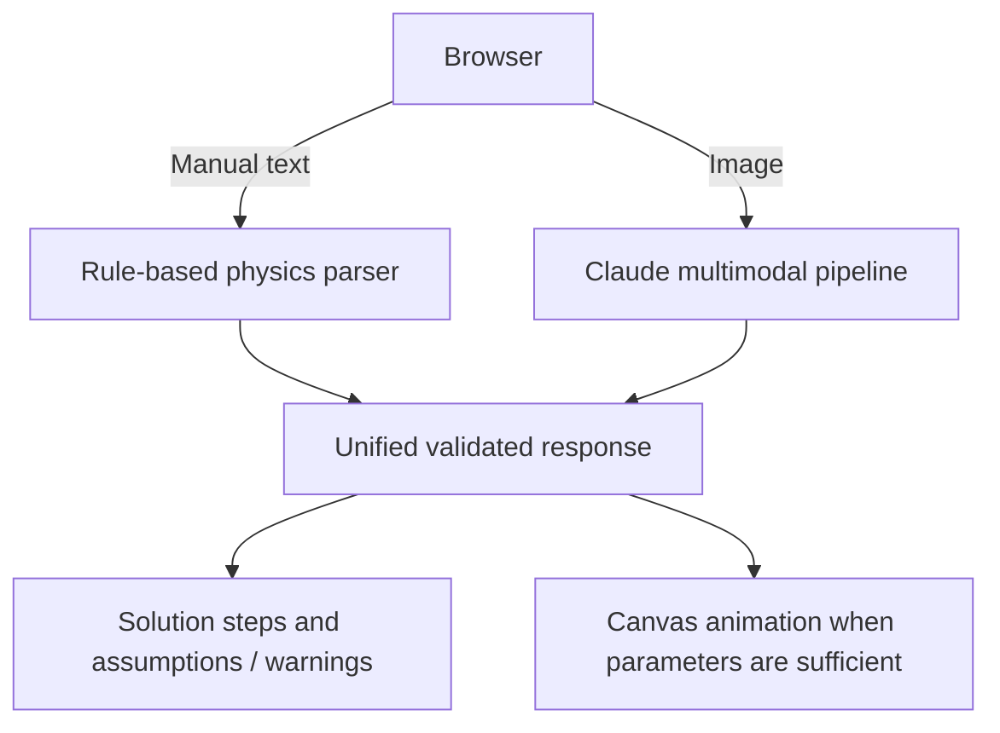

# Learnicer

**Turn physics problems into step-by-step explanations and Canvas motion animations.**

[](https://github.com/wjy-Jerry/2025X-City_Hackathon_Learnicer/actions/workflows/ci.yml)

Enter a problem as text and explore its solution and trajectory in the browser. The manual mode runs locally with no API key; an optional image mode uses Claude to read and analyze a photographed problem. Both paths return the same response shape, including visible assumptions and warnings when physics inputs are incomplete.

## Demo

The screenshots below were captured from the running, key-free manual browser demo using the built-in horizontal-launch example.

**1. Enter a problem (or load the example).**



**2. Read the solution and the assumptions used.**



**3. Play or replay the Canvas animation.**



The current interface is in Chinese. [Run the demo locally](#quick-start-no-api-key) to try it yourself.

## Why Learnicer

A solved equation can be hard to connect to physical motion. Learnicer places the problem text, ordered reasoning, and a playable trajectory in one view. When a required value is missing, it shows a warning instead of presenting an invented animation as fact.

## How it works

1. Choose **manual text** or **image upload** in the browser.
2. Manual text goes to a local rule-based parser. An image goes to Claude's multimodal pipeline and requires an API key.
3. The backend validates physics parameters and returns `problem_text`, `solution_steps`, `assumptions`, `warnings`, and nullable `animation_instructions`.
4. The page displays the explanation and, when the inputs support it, renders the selected motion on Canvas.

## Architecture



See the [architecture notes](docs/architecture.md) for dispatch, validation, and module details.

## Key engineering features

- **One response contract:** manual and image inputs feed the same validated result shape, which the frontend handles even when animation instructions are null.
- **Explicit physics assumptions:** conventional choices such as Earth gravity are reported. Missing essential speed, angle, or height blocks a misleading animation.
- **Useful without a key:** the browser's manual mode parses supported problems locally and includes an example.
- **Image analysis:** Claude can extract and analyze a problem from an uploaded image; the backend validates extracted parameters before building animation instructions.
- **Automated checks:** pytest covers the supported Flask workflow and physics contract; Node tests cover frontend and renderer behavior; GitHub Actions runs both on pushes and pull requests.

## Tech stack

| Layer | Technology |
| --- | --- |
| Backend | Python, Flask |
| Optional image analysis | Anthropic Claude API |
| Frontend | HTML, CSS, JavaScript, Canvas |
| Verification | pytest, pytest-cov, Node test runner, GitHub Actions |

## Quick start: no API key

Python 3.13 and a modern browser are sufficient for the manual demo. Node.js 24 is used for the browser contract tests.

```bash
git clone https://github.com/wjy-Jerry/2025X-City_Hackathon_Learnicer.git
cd 2025X-City_Hackathon_Learnicer
python -m venv .venv
source .venv/bin/activate
python -m pip install -r requirements.txt
python app.py
```

On Windows PowerShell, run `.venv\Scripts\Activate.ps1` in place of the `source` line.

Open **http://127.0.0.1:5000/**. Leave **手动输入（无需 API Key）** selected, click **填入示例题目** to load the example, then **解析文字并生成动画**. The page shows the solution, assumptions, and animation. Manual mode does not call OCR or Claude.

### Optional: analyze an image with Claude

Set `CLAUDE_API_KEY` in your environment or in a local `.env` file (see [`.env.example`](.env.example)), restart the app, and select **图片上传（Claude）**. The key is needed only for image analysis. Do not commit your `.env` file.

## Testing and CI

```bash
python -m pip install -r requirements-dev.txt
python -m compileall -q app.py config.py routes/upload.py services/claude_pipeline.py tests/backend
python -m pytest -q --cov=app --cov=routes.upload --cov=services.claude_pipeline --cov-report=term-missing
node --test tests/browser/*.test.js
```

GitHub Actions also checks JavaScript syntax and runs separate backend and browser/renderer jobs on every push and pull request. The supported Python application modules currently have **80% test coverage**. CI uses no paid API key: Claude calls are mocked, so these checks do not verify a live image request or a full end-to-end browser session. See [testing details](docs/testing.md).

## My contributions and the team project

**Original hackathon project:** This was built by a three-person team. I contributed to rapid prototype development, worked on the Claude-powered processing workflow, implemented application work using Flask, HTML/CSS, and JavaScript Canvas, and led the final product demonstration and presentation.

**Later portfolio engineering in this repository:** After the hackathon, the repository was cleaned up, the key-free browser demo and unified response contract were completed, physics assumptions were made explicit, an automated test suite and CI were added, and obsolete OCR/LLM paths were removed. These are later repository improvements, not claims about the original hackathon submission.

## Limitations

- The manual rule-based parser handles a limited set of physics problems, and the Canvas renderer supports selected motion types.
- Image analysis needs Claude API access. CI mocks that service rather than making paid live calls.
- Generated explanations and recognized image text should be checked against the original problem before relying on them.

## Project background

Learnicer began as a three-person project at the **2025 X-City Hackathon**, where the team received **Third Prize**. This repository also includes subsequent work to make the prototype easier to run, review, and maintain.

## Documentation

- [Architecture](docs/architecture.md)
- [API response contract](docs/api_contract.md)
- [Physics assumptions and validation](docs/physics_assumptions.md)
- [Supported tests](docs/testing.md)
- [Historical notes](docs/archive/README.md) — archived context, not current setup instructions
